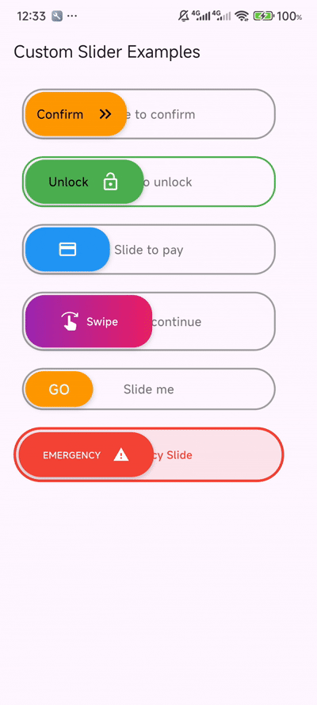

# HappySlider

A customizable slide-to-confirm widget for Flutter that provides a smooth sliding interaction. Users can slide a button from left to right to confirm an action, with extensive customization options for colors, text, icons, and button content.

<p align="center">
  
</p>
## Features

- Smooth sliding animation with drag gestures
- Customizable width, height, and slider button size
- Configurable colors for border, button, and background
- Support for custom text, text styles, and button content
- Optional default arrow icon or custom icon
- Callback function for slide completion
- Rounded corners and shadow effects
- Responsive and adaptable to various screen sizes

## Installation

Add the following to your `pubspec.yaml` file:

```yaml
dependencies:
  happy_slider: ^0.1.0
```

Then run:

```bash
flutter pub get
```

## Usage

Import the package in your Dart file:

```dart
import 'package:happy_slider/happy_slider.dart';
```

Add the `HappySlider` widget to your widget tree:

```dart
HappySlider(
  width: 300,
  height: 60,
  text: 'Slide to confirm',
  onSlideComplete: () => print('Slide completed!'),
)
```

## Example

Here's a complete example of using `HappySlider` with various customizations:

```dart
import 'package:flutter/material.dart';
import 'package:happy_slider/happy_slider.dart';

void main() {
  runApp(const MyApp());
}

class MyApp extends StatelessWidget {
  const MyApp({super.key});

  @override
  Widget build(BuildContext context) {
    return MaterialApp(
      home: Scaffold(
        appBar: AppBar(title: const Text('HappySlider Example')),
        body: Center(
          child: HappySlider(
            width: 300,
            height: 60,
            sliderWidth: 100,
            text: 'Slide to Unlock',
            borderColor: Colors.blue,
            buttonColor: Colors.blueAccent,
            backgroundColor: Colors.blue.shade50,
            borderWidth: 2.0,
            borderRadius: 30.0,
            textStyle: const TextStyle(
              color: Colors.blueGrey,
              fontSize: 16,
              fontWeight: FontWeight.w600,
            ),
            buttonText: 'Unlock',
            buttonTextStyle: const TextStyle(
              color: Colors.white,
              fontSize: 14,
              fontWeight: FontWeight.bold,
            ),
            buttonIcon: const Icon(Icons.lock_open, color: Colors.white),
            buttonIconSpacing: 8.0,
            showDefaultIcon: false,
            buttonContentAlignment: MainAxisAlignment.center,
            onSlideComplete: () {
              print('Slide completed!');
            },
          ),
        ),
      ),
    );
  }
}
```

## Properties

| Property | Type | Description | Default Value |
|----------|------|-------------|---------------|
| `width` | `double` | Total width of the slider widget | Required |
| `height` | `double` | Height of the slider widget | Required |
| `sliderWidth` | `double` | Width of the draggable slider button | 160 |
| `onSlideComplete` | `VoidCallback` | Callback when slide reaches threshold | Required |
| `borderColor` | `Color` | Color of the widget border | `Colors.grey` |
| `buttonColor` | `Color` | Background color of the slider button | `Colors.orange` |
| `backgroundColor` | `Color` | Background color of the slider container | `Colors.transparent` |
| `borderWidth` | `double` | Width of the border stroke | 2.0 |
| `text` | `String` | Text displayed in the background | 'Slide to confirm' |
| `textStyle` | `TextStyle?` | Style for the background text | null |
| `buttonTextStyle` | `TextStyle?` | Style for the button text | null |
| `borderRadius` | `double` | Border radius for rounded corners | 25.0 |
| `sliderButton` | `Widget?` | Custom widget for slider button content | null |
| `buttonText` | `String?` | Text to display on the slider button | null |
| `buttonIcon` | `Widget?` | Custom icon for the slider button | null |
| `buttonIconSpacing` | `double?` | Spacing between button text and icon | 14.0 |
| `showDefaultIcon` | `bool` | Show default arrow icon if no custom icon | true |
| `defaultIconColor` | `Color?` | Color of the default arrow icon | `Colors.black` |
| `defaultIconSize` | `double?` | Size of the default arrow icon | 24.0 |
| `buttonContentAlignment` | `MainAxisAlignment` | Horizontal alignment of button content | `MainAxisAlignment.center` |
| `buttonCrossAxisAlignment` | `CrossAxisAlignment` | Vertical alignment of button content | `CrossAxisAlignment.center` |

## Notes

- The slider requires the user to drag at least 80% of the available distance to trigger the `onSlideComplete` callback.
- If the slide is not completed, the button animates back to its original position.
- The widget is fully customizable to match your app's theme and design requirements.
- Ensure the `width` is sufficiently larger than `sliderWidth` to allow for smooth dragging.

## Contributing

Contributions are welcome! Please feel free to submit a pull request or open an issue on the [GitHub repository](https://github.com/MD-Redwan-Ul-Abir/happy_slider).

## License

This package is licensed under the MIT License. See the [LICENSE](LICENSE) file for details.

</xaiArtifact>